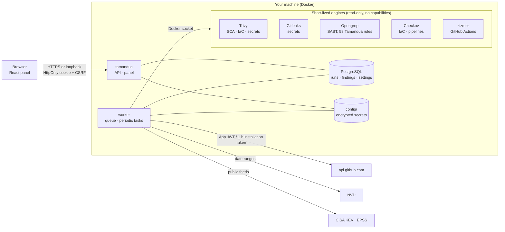

English · [Español](es/arquitectura.md)

# Architecture

Tamandua is three services: the **API** (FastAPI, which also serves the panel), one or more **workers** that run the
queued scans and the periodic tasks, and **PostgreSQL**, which holds all the state. The scan engines run as
short-lived sibling containers started by the worker, with the code mounted read-only, no capabilities, and memory,
CPU and process limits. The API has no access to Docker.



## Code layout

A modular monolith (`tamandua/`) whose layers are checked by import-linter on every PR (`make arch`, see
`pyproject.toml`):

```
tamandua/
  cli/          command line (scan for CI, demo, users…)
  app/          composition: API (api/: typed FastAPI routes, one module per context), worker,
                migrations (Alembic and data), demo data, panel static files, wiring (event subscribers and
                injected readers), integrity checks that span contexts
  modules/      the business logic, one package per context, top layer first; never imports from app/ or cli/
    compliance/     SBOM, VEX, CRA kit
    threats/        threat modeling, diagram and report
    reporting/      PDF/Markdown reports, shared report design, Overview
    runs/           runs (store, Markdown/SARIF), queue and jobs, batches, local scan (CLI), advisory watch,
                    assets through their runs (overview, reconciliation, purge), registry rebuild
    pullrequests/   PR review and watching
    scanning/       engines (engines, config_engines), plan, inventory, repository and image scans, OWASP
    findings/       run kinds, registry and lifecycle, triage, exclusions, Jira links, fix guides, re-verification,
                    due dates (SLA)
    sources/        repositories, assets (stable identity, scan branch, retirement), domains
    integrations/   GitHub App, Jira client, notifications (Slack/Teams/webhook), AI keys
    intel/          advisories, KEV/EPSS, local NVD copy, EUVD, sources and licenses
    identity/       users, sessions, TOTP
  shared/       cross-cutting code with no business logic: logs, encrypted store, paths, i18n (en/es catalogs),
                in-process events; never imports from modules/
```

The contexts are layered too, and import-linter checks it (`make arch`, exhaustive: a new context has to be placed):

```
compliance | threats      consumers: read everything below, nobody imports them
reporting
runs                      orchestration: jobs, the queue and the flows that touch several contexts
pullrequests
scanning | findings       domain: engines → findings list; the registry and everything decided about a finding
sources                   base: what gets scanned, the external clients, advisory knowledge, users
integrations
intel | identity
```

A context imports only the ones below it, and siblings joined by `|` never import each other (function-local imports
count). When a lower context needs something from a higher one, it doesn't import it: the composition root
(`app/wiring.py`, run once per process by the API, the worker and the CLI before anything else) wires it in. Two
tools, in this order: injecting a reader (findings get the run reader that tells how a re-verification went) and
in-process domain events (`shared/events.py`) for "something happened". Events are synchronous and run their
subscribers in order inside the publisher's call; an error stops the rest and reaches the publisher, and an event
nobody subscribed to is an error, so a process that wasn't wired fails instead of losing data. Today:

- `AssetPurged` (runs): a repository gone from GitHub for longer than the grace period. Runs deletes its runs first,
  then triage, the registry, Jira links, PR watching, the repository registry, exclusions and secret detection settings
  forget it, in that order. An interrupted purge leaves rows without runs, which `tamandua integrity` cleans up.
- `RepositoriesListed` (pullrequests): the PR watcher read the complete repository list of the installations (never a
  partial one); runs reconciles the analysed repositories with it and purges the ones past the grace period.

A finished run updates the registry and sends notifications directly: runs sits above findings and integrations.

The panel (`web/src`) follows the same idea, organized by feature (a light Feature-Sliced Design), with layers checked
by `tests/test_web_layers.py`: a layer never imports from the layers above it.

```
web/src/
  app/        composition: App (navigation), providers (TanStack Query)
  pages/      one screen per view (Overview, Findings, CVE tracker, Compliance…)
  features/   auth, onboarding, analyses, sources, findings, integrations, threats
  shared/     ui (Base UI + Tailwind), charts, api (client, types generated from OpenAPI, queries), i18n, lib
```

Server data goes through TanStack Query (`shared/api/queries.ts`): a cache shared across views, and polling only while
something is running. Types for the migrated routes come from the OpenAPI schema (`make openapi`).

API security lives in one place (`app/api/security.py`): allowed host → CSRF (Origin + action header) → session →
second factor → role → body size. Every route applies it through `deps.guard(Policy(...))`.
Handlers never read headers or cookies on their own; an unhandled error returns a 500 with no stack trace.
The React + TypeScript panel (`web/`) is built into `tamandua/app/static/`.

Services (compose): `api` (panel and API with FastAPI, no access to Docker), `worker` (runs the queued scans and the
periodic tasks; the only one with the Docker socket; it can scale out, and only the leader, elected with a PostgreSQL
lock, runs the periodic tasks), `postgres` and `opengrep` (only builds the engine image). The queue (`jobs`) and the
notification outbox (`outbox`, with retries) live in PostgreSQL: a restart loses nothing that was queued.

## Where each piece runs

The API keeps no state of its own: users, runs, the queue, settings, the encrypted secrets, the session signing key and
the local NVD copy are all in PostgreSQL. Several API instances can serve at once, and one without a persistent disk
(a serverless function) works too; its data folder only holds caches that rebuild themselves. The worker runs the
engines in one of two ways (`TAMANDUA_ENGINE_RUNNER`): a sibling container per engine through the Docker socket, or as
processes from the engines installed in its own image (`worker-standalone`), for platforms without a socket. Periodic
tasks run on the leader worker's clock, or are triggered from outside (`TAMANDUA_PERIODIC=external`). Every target is
in [deploy.md](deploy.md).

## How a scan flows

1. You click **Scan**, or a pull request is opened on a watched repository.
2. The API queues the job and answers right away; the panel shows live progress.
3. The worker asks GitHub for a one-hour installation token (kept in memory) and downloads a snapshot of the repository into `data/work/`.
4. It builds the plan (languages, applicable rules, manifests, IaC) and runs the engines one at a time: read-only snapshot, `--cap-drop ALL`, `no-new-privileges`, at most 3 GB of memory, 2 CPUs and 512 processes. Gitleaks, Opengrep, Checkov and zizmor run **with no network**; Trivy needs it to download its vulnerability database (cached in `data/trivy-cache/`) and sends nothing from the repository.
5. Results are normalized, deduplicated by a stable fingerprint, enriched with KEV/EPSS and merged into the repository's registry: whatever no longer shows up is marked **fixed**.
6. For a pull request, a single comment and a commit status are posted according to the configured threshold.
7. The snapshot is deleted.

## Data on disk

```
PostgreSQL (tamandua-pg volume; schema managed by Alembic migrations in tamandua/app/alembic)
  runs                runs: list row, full record, report and SARIF (JSONB + columns for filtering)
  registry_*          findings registry per asset (state, CVE with a GIN index) and per-run idempotency
  triage_decisions    triage decisions with their history
  users, sessions, auth_challenges   identity: users (scrypt, encrypted TOTP), sessions and 2FA challenges (hashes only)
  pr_watch, pr_reviews   PR watching: settings and branch heads per repository, one row per reviewed pull request
  repo_registry       one row per repository: scan branch and retirement mark
  documents           JSONB settings, one document each: due dates, exclusions, integrations, domains, batches,
                      threat models, advisory watching, Jira links, CRA kit…
  jobs, workers, outbox   scan queue, worker heartbeat and notification outbox with retries
  intel_*             local copy of NVD with KEV and EPSS for the CVE tracker (full-text search with a GIN index)
  vault_entries       encrypted secrets (AES-256-GCM with the master key), the session signing key and the setup code
data/
  feeds/            downloaded KEV and EPSS files (a cache that can be rebuilt)
  trivy-cache/      Trivy's vulnerability database
  logs/app.log      optional JSON copy of the logs (TAMANDUA_LOG_FILE; Compose sets it), rotated, no secrets
  backups/          copy of whatever each data migration touched (the last 5 are kept)
config/
  master.key        master key, only when TAMANDUA_MASTER_KEY isn't set (a single server)
```

**Upgrading without breaking data.** Alembic migrations (`tamandua/app/alembic/versions/`) own the database schema and
run at startup. For data that has to be rewritten, `tamandua/app/data_migrations.py` compares the version stored in
the database (document `data-version`; an older `data-version.json` is adopted once) with the code's version and applies the pending migrations in order, exactly once, after copying
to `data/backups/` only what they are about to touch. Each step records its version: if one fails, the next start
resumes from there. A fresh install starts at the latest version; data from a newer version than the code (a
downgrade) blocks startup instead of risking damage.

## Design decisions

- **Few dependencies, pinned.** FastAPI, uvicorn, Pydantic, SQLAlchemy (Core), psycopg and Alembic, at exact
  versions: a small attack surface and security updates that are easy to follow.
- **Polling instead of webhooks.** The server doesn't need to be reachable from the internet.
- **One GitHub App per workspace**, with four permissions. To cover several organizations, GitHub requires the App to be installable on any account; the administrator explicitly picks which ones to connect to the workspace. A leaked key would reach every installation of that App, so keeping it safe is still critical.
- **Honest results.** Whatever couldn't be tested shows up as `not_tested` with its reason; an incomplete scan is never presented as "zero vulnerabilities".
- **Language-neutral storage, rendered per reader.** Every user-facing text exists in English (the source and the
  fallback) and Spanish, in catalogs (`tamandua/shared/i18n/locales/` and `web/src/shared/i18n/locales/`). What gets
  stored (findings, progress, limitations, errors) is a message code plus parameters, rendered when read in the
  reader's language: the API renders per request, and reports, PR comments, notifications, Jira and the CLI render
  with an explicit locale (`TAMANDUA_DEFAULT_LOCALE`, `en` by default). The same finding reads naturally in either
  language, and switching languages never rewrites data. Third-party text (advisories, scanner check names) is shown
  as published, never machine-translated.

## Not yet (deliberately deferred)

The community edition comes first, done right. These are prepared for, but not built:

- **Real multi-tenancy.** Every table already carries `tenant_id` (always `default` today); PostgreSQL Row Level
  Security and the concept of an organization are still missing.
- **Observability.** Traces and metrics with OpenTelemetry (today: structured JSON logs and the worker heartbeat).
- **SSO (OIDC/SAML) and usage-based quotas.** They belong to the managed edition and live outside this repository.
