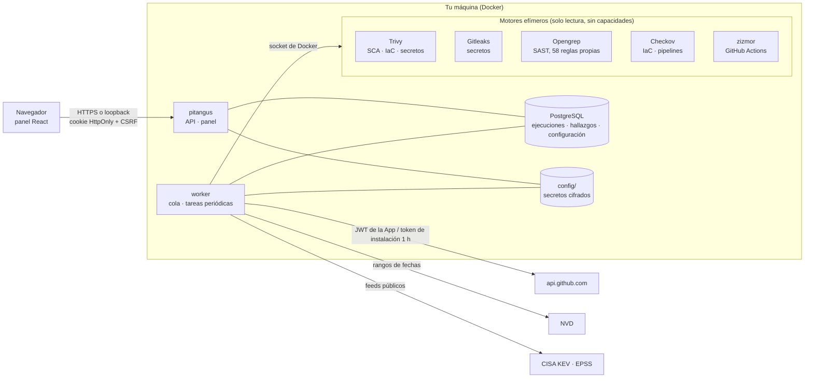

[English](../architecture.md) · Español

# Arquitectura

Pitangus son tres servicios: el **API** (FastAPI, sirve también el panel), uno o varios **workers** que ejecutan los
análisis de la cola y las tareas periódicas, y **PostgreSQL**, donde vive todo el estado. Los motores de análisis corren
como contenedores hermanos efímeros lanzados por el worker, con el código montado en solo lectura, sin capacidades y
con límites de memoria, CPU y procesos. El API no tiene acceso a Docker.



## Estructura del código

Monolito modular (`pitangus/`), con capas que comprueba import-linter en cada PR (`make arch`, ver `pyproject.toml`):

```
pitangus/
  cli/          línea de comandos (scan para CI, demo, usuarios…)
  app/          composición: API (api/: rutas FastAPI tipadas, un módulo por contexto), worker,
                migraciones (Alembic y de datos), datos de demostración, estáticos del panel, cableado (suscriptores
                de eventos y lectores inyectados), comprobaciones de integridad entre contextos
  modules/      el negocio, un paquete por contexto, de la capa de arriba a la de abajo; no importa de app/ ni de cli/
    compliance/     SBOM, VEX, kit CRA
    threats/        modelado de amenazas, diagrama e informe
    reporting/      informes PDF/Markdown, diseño común de los informes, Resumen
    runs/           ejecuciones (almacén, Markdown/SARIF), cola y trabajos, lotes, análisis local (CLI), vigilancia
                    de avisos, activos vistos desde sus ejecuciones (resumen, reconciliación, purga),
                    reconstrucción del registro
    pullrequests/   revisión de PR y vigilancia
    scanning/       motores (engines, config_engines), plan, inventario, análisis de repositorio e imagen, OWASP
    findings/       tipos de ejecución, registro y ciclo de vida, triage, exclusiones, vínculos con Jira, guía de
                    corrección, reverificación, plazos (SLA)
    sources/        repositorios, activos (identidad estable, rama de análisis, retirada), dominios
    integrations/   GitHub App, cliente de Jira, avisos (Slack/Teams/webhook), claves de IA
    intel/          avisos, KEV/EPSS, copia local de NVD, EUVD, fuentes y licencias
    identity/       usuarios, sesiones, TOTP
  shared/       transversal sin negocio: logs, almacén cifrado, rutas, i18n (catálogos en/es), eventos en proceso;
                no importa de modules/
```

Los contextos también van por capas, y import-linter lo comprueba (`make arch`, exhaustivo: un contexto nuevo hay que
colocarlo en alguna):

```
compliance | threats      consumidores: leen todo lo de abajo y nadie los importa
reporting
runs                      orquestación: trabajos, cola y los flujos que tocan varios contextos
pullrequests
scanning | findings       dominio: motores → lista de hallazgos; el registro y todo lo que se decide sobre un hallazgo
sources                   base: qué se analiza, los clientes externos, el conocimiento de avisos, los usuarios
integrations
intel | identity
```

Cada contexto importa solo los de debajo, y los hermanos unidos por `|` no se conocen entre sí (también cuentan los
imports dentro de una función). Si un contexto de abajo necesita algo de uno de arriba, no lo importa: se lo conecta la
raíz de composición (`app/wiring.py`, que la API, el worker y la CLI ejecutan una vez por proceso antes que nada). Hay
dos herramientas, por este orden: inyectarle un lector (findings recibe el de ejecuciones, que dice cómo acabó una
reverificación) y los eventos de dominio en proceso (`shared/events.py`) para avisar de que «algo pasó». Son síncronos:
los suscriptores corren en orden dentro de la llamada de quien publica; un error detiene a los demás y le llega a quien
publicó, y publicar un evento sin suscriptores es un error, así que un proceso sin cablear falla en vez de perder datos.
Hoy hay dos:

- `AssetPurged` (runs): un repositorio que desapareció de GitHub y superó el margen. Runs borra primero sus
  ejecuciones; después lo olvidan, en este orden, el triage, el registro, los vínculos con Jira, la vigilancia de PR,
  el registro de repositorios, las exclusiones y los ajustes de detección de secretos. Una purga interrumpida deja filas
  sin ejecuciones, y `pitangus integrity` las limpia.
- `RepositoriesListed` (pullrequests): el vigilante de PR leyó la lista completa de repositorios de las instalaciones
  (nunca una parcial); runs la contrasta con lo analizado y purga lo que ya superó el margen.

Una ejecución terminada actualiza el registro y manda los avisos con llamadas directas: runs está por encima de findings
y de integrations.

El panel (`web/src`) sigue la misma idea, por funcionalidad (Feature-Sliced Design ligero), con capas que comprueba
`tests/test_web_layers.py`: una capa no importa de las de arriba.

```
web/src/
  app/        composición: App (navegación), proveedores (TanStack Query)
  pages/      una pantalla por vista (Resumen, Hallazgos, CVE tracker, Cumplimiento…)
  features/   auth, onboarding, analyses, sources, findings, integrations, threats
  shared/     ui (Base UI + Tailwind), charts, api (cliente, tipos generados del OpenAPI, consultas), i18n, lib
```

Los datos del servidor van con TanStack Query (`shared/api/queries.ts`): caché compartida entre vistas y sondeo solo
mientras hay algo en marcha. Los tipos de las rutas migradas salen del OpenAPI (`make openapi`).

La seguridad de la API está en un solo sitio (`app/api/security.py`): host permitido → CSRF (Origin + cabecera de
acción) → sesión → segundo factor → rol → tamaño del cuerpo. Todas las rutas la aplican con
`deps.guard(Policy(...))`. Los manejadores no leen cabeceras ni cookies por su cuenta; un error no controlado responde
500 sin traza.
El panel React + TypeScript (`web/`) se compila a `pitangus/app/static/`.

Servicios (compose): `api` (panel y API con FastAPI, sin acceso a Docker), `worker` (ejecuta los análisis de la
cola y las tareas periódicas; el único con el socket de Docker; se puede escalar y las tareas periódicas solo las corre el
líder, elegido con un cerrojo de PostgreSQL), `postgres` y `opengrep` (solo construye la imagen del motor). La cola
(`jobs`) y el buzón de avisos (`outbox`, con reintentos) viven en PostgreSQL: un reinicio no pierde lo encolado.

## Dónde corre cada pieza

La API no guarda estado propio: usuarios, ejecuciones, la cola, la configuración, los secretos cifrados, la clave de
firma de sesiones y la copia local de NVD están en PostgreSQL. Pueden atender varias instancias de la API a la vez, y
también una sin disco persistente (una función serverless); su carpeta de datos solo guarda cachés que se regeneran. El
worker ejecuta los motores de una de dos formas (`PITANGUS_ENGINE_RUNNER`): un contenedor hermano por motor a través
del socket de Docker, o como procesos, con los motores instalados en su propia imagen (`worker-standalone`), para
plataformas sin socket. Las tareas periódicas van con el reloj del worker líder o se disparan desde fuera
(`PITANGUS_PERIODIC=external`). Todos los destinos están en [despliegue.md](despliegue.md).

## Flujo de un análisis

1. Pulsas **Analizar** o se abre un PR en un repositorio vigilado.
2. La API encola el trabajo y responde al momento; el panel muestra el progreso en vivo.
3. El trabajador pide a GitHub un token de instalación de una hora (en memoria) y descarga una instantánea del repositorio en `data/work/`.
4. Se calcula el plan (lenguajes, reglas aplicables, manifiestos, IaC) y se lanzan los motores uno a uno: instantánea en solo lectura, `--cap-drop ALL`, `no-new-privileges`, 3 GB de memoria, 2 CPU y 512 procesos como máximo. Gitleaks, Opengrep, Checkov y zizmor van **sin red**; Trivy la necesita para descargar su base de vulnerabilidades (cacheada en `data/trivy-cache/`) y no envía nada del repositorio.
5. Los resultados se normalizan, se deduplican por huella estable, se enriquecen con KEV/EPSS y se incorporan al registro del repositorio: lo que ya no aparece queda **remediado**.
6. Si era un PR, se publica un comentario único y un estado de commit según el umbral configurado.
7. La instantánea se borra.

## Datos en disco

```
PostgreSQL (volumen pitangus-pg; esquema con migraciones de Alembic en pitangus/app/alembic)
  runs                ejecuciones: fila de listado, registro completo, informe y SARIF (JSONB + columnas para filtrar)
  registry_*          registro de hallazgos por activo (estado, CVE con índice GIN) e idempotencia por ejecución
  triage_decisions    decisiones de triage con su historial
  users, sessions, auth_challenges   identidad: usuarios (scrypt, TOTP cifrado), sesiones y retos de 2FA (solo hashes)
  pr_watch, pr_reviews   vigilancia de PRs: configuración y cabezas de rama por repositorio, una fila por PR revisado
  repo_registry       una fila por repositorio: rama de análisis y marca de retirada
  documents           configuración por documento JSONB: plazos, exclusiones, integraciones, dominios, lotes,
                      modelos de amenazas, vigilancia de avisos, enlaces con Jira, kit CRA…
  jobs, workers, outbox   cola de análisis, latido de los workers y buzón de avisos con reintentos
  intel_*             copia local de NVD con KEV y EPSS para el CVE tracker (búsqueda de texto con índice GIN)
  vault_entries       secretos cifrados (AES-256-GCM con la clave maestra), la clave de firma de sesiones y el código inicial
data/
  feeds/            ficheros descargados de KEV y EPSS (caché regenerable)
  trivy-cache/      base de vulnerabilidades de Trivy
  logs/app.log      copia JSON opcional de los registros (PITANGUS_LOG_FILE; Compose la activa), rotada, sin secretos
  backups/          copia de lo que tocó cada migración de datos (se guardan las 5 últimas)
config/
  master.key        clave maestra, solo si no se define PITANGUS_MASTER_KEY (un único servidor)
```

**Actualizar sin romper los datos.** El esquema de la base lo llevan las migraciones de Alembic
(`pitangus/app/alembic/versions/`), que se aplican al arrancar. Para datos que haya que reescribir,
`pitangus/app/data_migrations.py` compara la versión
guardada en la base (documento `data-version`; un `data-version.json` antiguo se adopta una vez) con la del código y aplica, en orden y una sola vez, las migraciones pendientes,
tras copiar a `data/backups/` solo lo que van a tocar. Cada paso guarda su versión: si uno falla, el siguiente
arranque reanuda desde ahí. Una instalación nueva nace en la última versión; unos datos de una versión más nueva
que el código (volver a una versión anterior) impiden arrancar en vez de arriesgarse a estropearlos.

## Decisiones de diseño

- **Pocas dependencias y fijadas.** FastAPI, uvicorn, Pydantic, SQLAlchemy (Core), psycopg y Alembic, con versión
  exacta: poca superficie de ataque y actualizaciones de seguridad fáciles de seguir.
- **Sondeo en vez de webhooks.** El servidor no necesita ser accesible desde internet.
- **Una GitHub App por workspace**, con cuatro permisos. Para varias organizaciones, GitHub exige que pueda instalarse en cualquier cuenta; el administrador escoge explícitamente cuáles conectar al workspace. Una clave filtrada tendría acceso a todas las instalaciones de esa App, por lo que su custodia sigue siendo crítica.
- **Honestidad en los resultados.** Lo que no se pudo probar sale como `not_tested` con su motivo; un análisis incompleto nunca se presenta como «cero vulnerabilidades».
- **Lo guardado no tiene idioma; se muestra en el de quien lee.** Todo texto que lee una persona existe en inglés
  (origen y respaldo) y en español, en catálogos (`pitangus/shared/i18n/locales/` y `web/src/shared/i18n/locales/`).
  Lo que se guarda (hallazgos, progreso, limitaciones, errores) es un código de mensaje con sus parámetros, que se
  muestra al leerlo en el idioma de quien lo lee: la API lo hace por petición, y los informes, comentarios de PR,
  avisos, Jira y la CLI con un idioma explícito (`PITANGUS_DEFAULT_LOCALE`, `en` por defecto). Un mismo hallazgo se
  lee con naturalidad en los dos idiomas, y cambiar de idioma nunca reescribe datos. El texto de terceros (avisos,
  nombres de comprobaciones de los motores) se muestra tal como se publicó, sin traducción automática.

## Pendiente (aplazado a propósito)

Primero la edición community bien hecha. Queda preparado, pero sin construir:

- **Multiinquilino real.** Cada tabla ya lleva `tenant_id` (hoy siempre `default`); falta Row Level Security en
  PostgreSQL y el concepto de organización.
- **Observabilidad.** Trazas y métricas con OpenTelemetry (hoy: log JSON estructurado y latido de los workers).
- **SSO (OIDC/SAML) y cuotas por consumo.** Son de la edición gestionada y viven fuera de este repositorio.
